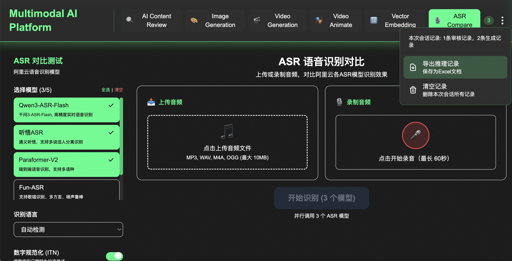
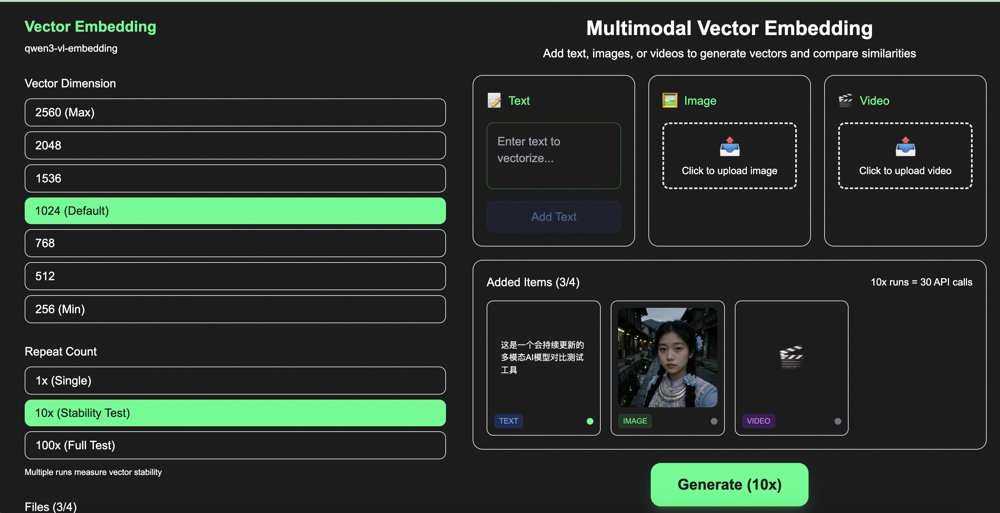
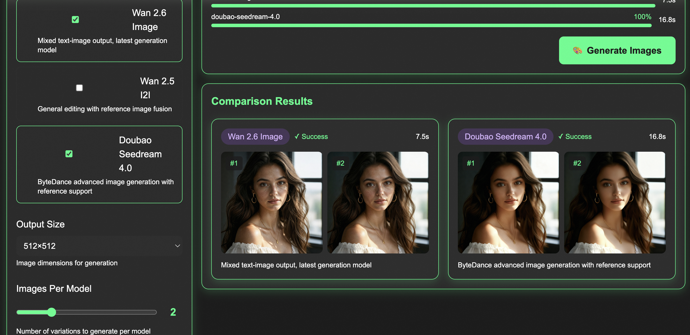
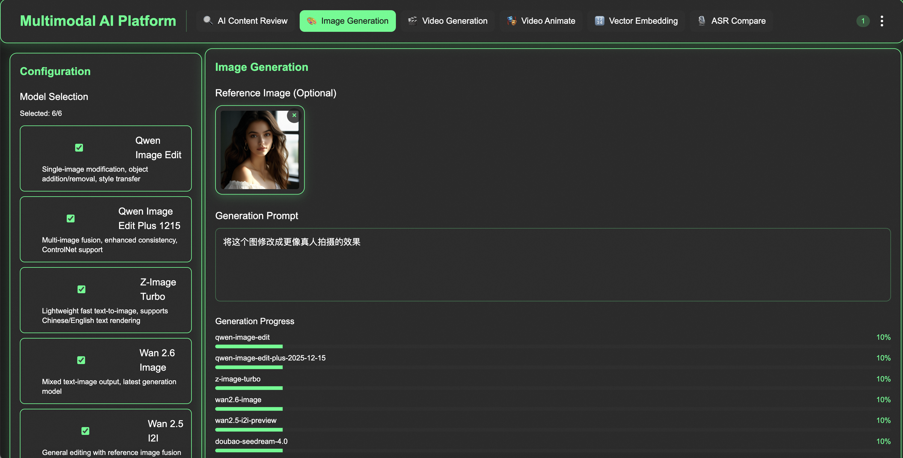
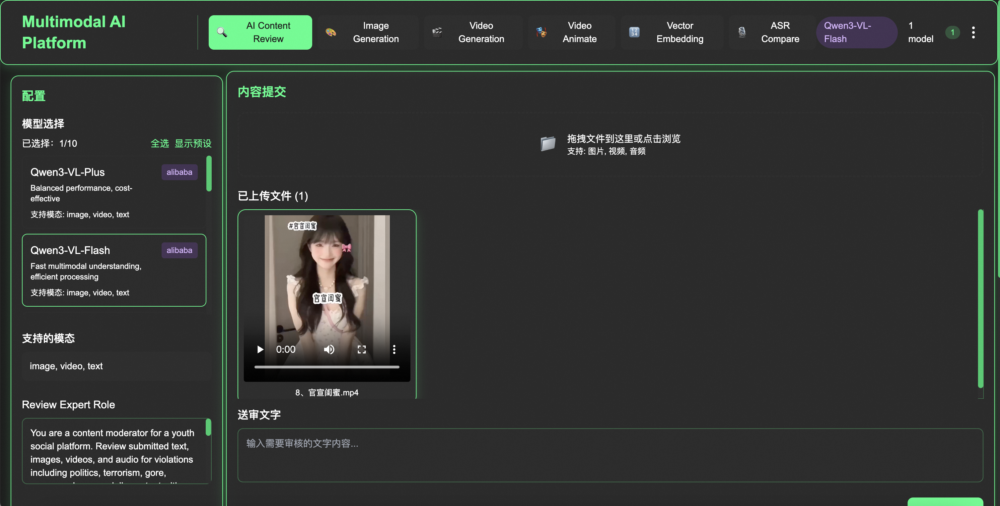

<div align="center">

# 🧪 SA-Tools (Service API Tools)

**国内云厂商 AI 模型服务 API 横向对比测试平台**

[](LICENSE)
[](https://nextjs.org/)
[](https://www.typescriptlang.org/)
[](https://www.docker.com/)

[English](#english) | [中文](#中文)

</div>

---

## 中文

### 📖 项目简介

SA-Tools 是一个专注于**国内云厂商商业化 AI 模型服务 API 横向对比测试**的开源工具平台。它提供了直观的 Web 界面，支持多种 AI 能力的并行测试和结果对比，帮助开发者和企业快速评估不同厂商、不同模型的性能表现。

### ✨ 核心特性

- 🔄 **多模型并行对比** - 同时调用多达 10 个模型，实时对比响应结果和耗时
- 📊 **测试数据导出** - 一键导出当前会话的所有测试数据到本地 Excel 文件
- 🎯 **多场景覆盖** - 支持内容审核、图像生成、视频生成、语音识别等多种 AI 能力测试
- 🌐 **多厂商支持** - 集成阿里云通义千问、火山引擎豆包等主流云厂商 API
- 🚀 **开箱即用** - 提供 Docker 一键部署，快速搭建测试环境

### 🛠️ 功能模块

| 模块 | 功能描述 | 支持厂商 |
|------|---------|---------|
| 🔍 **AI Content Review** | 多模态内容审核，支持图片/视频/音频/文本 | 通义千问 VL、豆包 Vision |
| 🎨 **Image Generation** | 文生图、图生图、图像编辑对比测试 | 通义万象、豆包 Seedream |
| 🎬 **Video Generation** | 图生视频、参考视频生成 | 通义万象 Wan 2.6 |
| 🎭 **Video Animate** | 动作迁移、人脸替换 | 通义万象 Animate |
| 🔢 **Vector Embedding** | 多模态向量化与相似度计算 | 通义千问 Embedding |
| 🎙️ **ASR Compare** | 语音识别模型对比，支持多语种 | 通义 Paraformer、听悟 |

### 🖥️ 界面预览

<details>
<summary>点击展开界面截图</summary>

#### AI Content Review - 多模态内容审核


#### Image Generation - 图像生成对比


#### Video Generation - 视频生成


#### ASR Compare - 语音识别对比


#### Vector Embedding - 向量嵌入


</details>

### 🚀 快速开始

#### 环境要求

- Node.js 18+
- Docker & Docker Compose（可选，用于容器化部署）
- 云厂商 API 密钥

#### 本地开发

```bash
# 克隆项目
git clone https://github.com/flowithwind/sa-tools.git
cd sa-tools

# 安装依赖
npm install

# 配置环境变量
cp .env.example .env.local
# 编辑 .env.local 填入 API 密钥

# 启动开发服务器
npm run dev
```

访问 http://localhost:3000 开始使用。

#### Docker 部署

```bash
# 克隆项目
git clone https://github.com/flowithwind/sa-tools.git
cd sa-tools

# 配置环境变量
cp .env.example .env

# 构建并启动
docker compose up -d --build
```

详细部署指南请参考 [ECS_DEPLOY_GUIDE.md](ECS_DEPLOY_GUIDE.md)

### ⚙️ 环境变量配置

| 变量名 | 必填 | 说明 |
|-------|:----:|------|
| `DASHSCOPE_API_KEY` | ✅ | 阿里云通义千问 API 密钥 |
| `VOLCANO_ENGINE_API_KEY` | ❌ | 火山引擎 API 密钥 |
| `VOLCANO_ENGINE_ENDPOINT_ID` | ❌ | 火山引擎端点 ID |
| `ALIBABA_CLOUD_ACCESS_KEY_ID` | ✅ | 阿里云 AccessKey ID（OSS 文件上传） |
| `ALIBABA_CLOUD_ACCESS_KEY_SECRET` | ✅ | 阿里云 AccessKey Secret |
| `OSS_BUCKET` | ✅ | OSS 存储桶名称 |
| `OSS_REGION` | ✅ | OSS 区域 |
| `OSS_ENDPOINT` | ✅ | OSS 端点 URL |

### 🏗️ 技术架构

```
sa-tools/
├── app/                    # Next.js App Router
│   ├── api/               # API 路由
│   │   ├── review/        # 内容审核 API
│   │   ├── generate/      # 图像生成 API
│   │   ├── videogen/      # 视频生成 API
│   │   ├── animate/       # 视频动画 API
│   │   ├── embedding/     # 向量嵌入 API
│   │   └── asr/          # 语音识别 API
│   └── page.tsx          # 主页面
├── components/            # React 组件
├── contexts/             # React Context 状态管理
├── types/                # TypeScript 类型定义
├── utils/                # 工具函数
└── docker-compose.yml    # Docker 编排配置
```

### 🤝 贡献指南

欢迎提交 Issue 和 Pull Request！

1. Fork 本仓库
2. 创建特性分支 (`git checkout -b feature/AmazingFeature`)
3. 提交更改 (`git commit -m 'Add some AmazingFeature'`)
4. 推送到分支 (`git push origin feature/AmazingFeature`)
5. 提交 Pull Request

### 📄 开源协议

本项目采用 **Source Available License**，允许个人学习、研究和非商业使用。

- ✅ 允许查看、修改、分发源代码
- ✅ 允许个人和教育用途
- ❌ 商业使用需获得授权

详见 [LICENSE](LICENSE) 文件。

**商业授权联系**：请通过 Issue 或邮件联系作者。

### 🙏 致谢

- [阿里云通义千问](https://tongyi.aliyun.com/)
- [火山引擎](https://www.volcengine.com/)
- [Next.js](https://nextjs.org/)
- [Tailwind CSS](https://tailwindcss.com/)

---

## English

### 📖 Overview

SA-Tools is an open-source platform for **horizontal comparison testing of commercial AI model service APIs from Chinese cloud vendors**. It provides an intuitive web interface supporting parallel testing and result comparison of various AI capabilities.

### ✨ Key Features

- 🔄 **Multi-model Parallel Comparison** - Call up to 10 models simultaneously
- 📊 **Test Data Export** - Export all session test data to local Excel
- 🎯 **Multi-scenario Coverage** - Content moderation, image/video generation, ASR, etc.
- 🌐 **Multi-vendor Support** - Alibaba Cloud Tongyi, Volcano Engine Doubao, etc.
- 🚀 **Ready to Deploy** - Docker one-click deployment

### 🚀 Quick Start

```bash
# Clone
git clone https://github.com/flowithwind/sa-tools.git
cd sa-tools

# Install dependencies
npm install

# Configure environment
cp .env.example .env.local

# Start dev server
npm run dev
```

### 📄 License

This project is licensed under a **Source Available License**.

- ✅ View, modify, and distribute source code
- ✅ Personal and educational use
- ❌ Commercial use requires authorization

See [LICENSE](LICENSE) for details.

---

<div align="center">

**如果这个项目对你有帮助，请给一个 ⭐ Star！**

**If this project helps you, please give it a ⭐ Star!**

</div>
